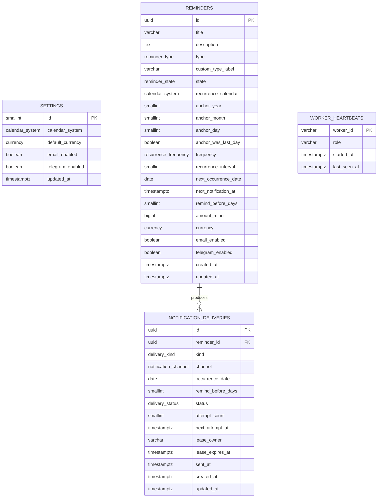
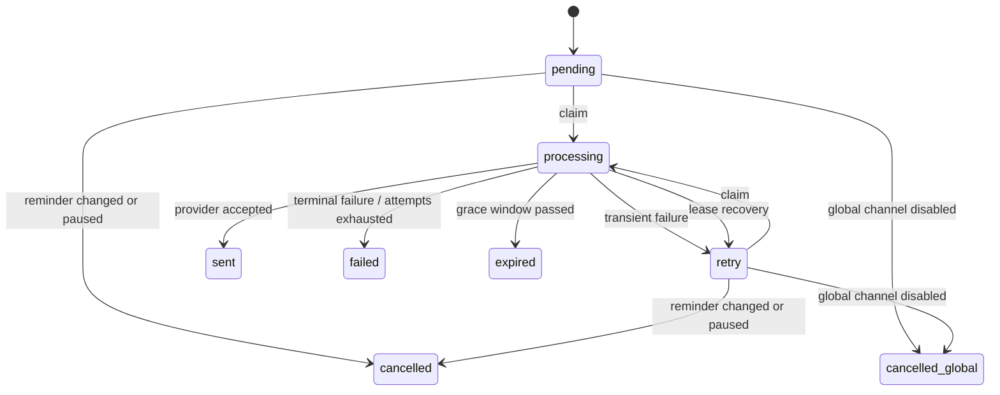

# Data model

PostgreSQL is the source of truth for reminders, preferences, schedule materialization, and notification delivery state. This document is logical schema guidance; checked-in SQL migrations are authoritative once implementation begins.

## 1. Entity relationship model



`SETTINGS` has exactly one row. `WORKER_HEARTBEATS` is operational state, not user data.

## 2. Enum domains

### `calendar_system`

- `gregorian`
- `jalali`

### `currency`

- `IRR` — Iranian rial, zero minor decimal digits
- `USD` — US dollar, two minor decimal digits

### `reminder_type`

- `birthday`
- `subscription`
- `debt`
- `rent`
- `bill`
- `insurance`
- `membership`
- `maintenance`
- `medication_refill`
- `tax_license`
- `custom`

### `reminder_state`

- `active`
- `paused`
- `completed` — terminal for one-time reminders; recurring reminders never enter this automatically

### `recurrence_frequency`

- `once`
- `daily`
- `weekly`
- `monthly`
- `yearly`

### `notification_channel`

- `email`
- `telegram`

### `delivery_kind`

- `occurrence`
- `provider_test`

### `delivery_status`

- `pending` — eligible and ready to be claimed at `next_attempt_at`
- `processing` — claimed under a bounded lease
- `retry` — failed transiently and scheduled for another attempt
- `sent` — provider accepted the request
- `failed` — terminal provider/configuration failure
- `expired` — catch-up window passed before a successful send
- `cancelled` — reminder edit, pause, delete policy, or per-reminder channel change made it ineligible
- `cancelled_global` — global settings disabled the channel

## 3. `settings`

| Column             | Type          | Null | Default / constraint                       |
| ------------------ | ------------- | ---- | ------------------------------------------ |
| `id`               | `smallint`    | No   | Primary key; check `id = 1`                |
| `calendar_system`  | enum          | No   | Seeded from `DEFAULT_CALENDAR_SYSTEM`      |
| `default_currency` | enum          | No   | Seeded from `DEFAULT_CURRENCY`             |
| `email_enabled`    | boolean       | No   | Seeded from `DEFAULT_EMAIL_ENABLED`        |
| `telegram_enabled` | boolean       | No   | Seeded from `DEFAULT_TELEGRAM_ENABLED`     |
| `created_at`       | `timestamptz` | No   | Transaction timestamp                      |
| `updated_at`       | `timestamptz` | No   | Transaction timestamp, updated on mutation |

Environment defaults insert this row only when it does not exist. Restarts never overwrite user-edited settings.

## 4. `reminders`

| Column                 | Type           | Null | Rule                                                                               |
| ---------------------- | -------------- | ---- | ---------------------------------------------------------------------------------- |
| `id`                   | `uuid`         | No   | Server-generated primary key                                                       |
| `title`                | `varchar(120)` | No   | Trimmed, at least one character                                                    |
| `description`          | `text`         | Yes  | Maximum 2,000 characters enforced by app and DB check                              |
| `type`                 | enum           | No   | Predefined type                                                                    |
| `custom_type_label`    | `varchar(40)`  | Yes  | Required only when type is `custom`                                                |
| `state`                | enum           | No   | Default `active`                                                                   |
| `recurrence_calendar`  | enum           | No   | Calendar that gives the anchor semantic meaning                                    |
| `anchor_year`          | `smallint`     | No   | Calendar year supplied at creation/edit; converted date must be in supported range |
| `anchor_month`         | `smallint`     | No   | 1–12                                                                               |
| `anchor_day`           | `smallint`     | No   | 1–31 plus adapter validation                                                       |
| `anchor_was_last_day`  | boolean        | No   | Preserves explicit month-end intent                                                |
| `frequency`            | enum           | No   | Once/daily/weekly/monthly/yearly                                                   |
| `recurrence_interval`  | `smallint`     | No   | Check 1–99                                                                         |
| `next_occurrence_date` | `date`         | Yes  | Canonical Gregorian date; null only when completed                                 |
| `next_notification_at` | `timestamptz`  | Yes  | UTC instant for lead-day date at configured local send time                        |
| `remind_before_days`   | `smallint`     | No   | Check 0–365                                                                        |
| `amount_minor`         | `bigint`       | Yes  | Check 0–9,999,999,999,999                                                          |
| `currency`             | enum           | Yes  | Present exactly when amount is present                                             |
| `email_enabled`        | boolean        | No   | Default false                                                                      |
| `telegram_enabled`     | boolean        | No   | Default false                                                                      |
| `created_at`           | `timestamptz`  | No   | Transaction timestamp                                                              |
| `updated_at`           | `timestamptz`  | No   | Concurrency token and transaction timestamp                                        |

### Core constraints

- `(amount_minor IS NULL) = (currency IS NULL)`.
- `type = 'custom'` requires a non-blank custom label; other types require it to be null.
- `state = 'completed'` requires `frequency = 'once'` and null materialized schedule fields.
- Active or paused reminders require non-null `next_occurrence_date` and `next_notification_at`.
- Anchor components pass application calendar validation before insert. The converted Gregorian date must fall from `1900-01-01` through `2400-12-31`; database checks still enforce broad numeric ranges.
- Description is stored as plain text. Empty trimmed descriptions become null.

### Indexes

```text
PRIMARY KEY (id)
INDEX reminders_dashboard_order (state, next_occurrence_date, id)
INDEX reminders_scheduler_due (next_notification_at, id) WHERE state = 'active'
INDEX reminders_occurrence_due (next_occurrence_date, id) WHERE state = 'active'
INDEX reminders_type_filter (type, state, next_occurrence_date)
```

Search uses `ILIKE` for the personal-scale MVP. Add a trigram/full-text index only after measurement shows need.

## 5. Why anchors and a materialized schedule both exist

For an annual Jalali reminder, `1405-01-01` means “the first day of Farvardin,” not “repeat every Gregorian year from its converted timestamp.” Storing only UTC would lose that meaning. Storing only calendar components would make every dashboard/scheduler query expensive.

The anchor is semantic and stable. `next_occurrence_date` is a date-only canonical Gregorian value, so it does not drift when a timestamp crosses a timezone boundary. `next_notification_at` is an exact UTC instant. These derived caches are recalculated when:

- the reminder is created;
- its date, recurrence, lead time, or recurrence calendar is edited;
- its current occurrence passes;
- the operator intentionally migrates `APP_TIMEZONE` or send time.

Global display calendar changes do not recalculate these fields.

## 6. Month-end policy

`anchor_was_last_day` differentiates these cases:

- User chooses January 31: it is the month’s last day, so monthly recurrence uses every target month’s last day.
- User chooses January 30: February may clamp to its last day, but March returns to day 30.
- User chooses Jalali Esfand 30 in a leap year: a non-leap year clamps to Esfand 29, then a later leap year returns to day 30.

The immutable numeric anchor prevents a clamped occurrence from becoming the new recurrence anchor.

## 7. Money representation

`amount_minor` is an integer:

- `1,250,000 IRR` stores `1250000` because IRR uses zero display decimals.
- `12.50 USD` stores `1250` because USD uses two display decimals.

Parsing accepts localized grouping separators at the UI boundary but produces a validated integer before persistence. The API transports money as a string minor-unit value to avoid JavaScript unsafe-integer and floating-point errors.

Changing the default currency affects new reminder forms only. There is no rate table and no conversion.

## 8. `notification_deliveries`

| Column                | Type           | Null | Rule                                                       |
| --------------------- | -------------- | ---- | ---------------------------------------------------------- |
| `id`                  | `uuid`         | No   | Primary key                                                |
| `reminder_id`         | `uuid`         | Yes  | FK to reminder; null only for provider tests               |
| `kind`                | enum           | No   | Occurrence or provider test                                |
| `channel`             | enum           | No   | Email or Telegram                                          |
| `occurrence_date`     | `date`         | Yes  | Canonical Gregorian date; required for occurrence delivery |
| `remind_before_days`  | `smallint`     | Yes  | Required for occurrence delivery                           |
| `scheduled_for`       | `timestamptz`  | No   | Intended notification instant                              |
| `status`              | enum           | No   | State machine value                                        |
| `attempt_count`       | `smallint`     | No   | Default 0; non-negative                                    |
| `next_attempt_at`     | `timestamptz`  | Yes  | Required for pending/retry                                 |
| `lease_owner`         | `varchar(100)` | Yes  | Random worker instance identifier                          |
| `lease_expires_at`    | `timestamptz`  | Yes  | Required while processing                                  |
| `provider_message_id` | `varchar(255)` | Yes  | Provider receipt identifier when safe/available            |
| `last_error_code`     | `varchar(80)`  | Yes  | Safe internal category/code                                |
| `last_error_detail`   | `varchar(500)` | Yes  | Redacted operator detail; no provider body/secrets         |
| `sent_at`             | `timestamptz`  | Yes  | Set when accepted by provider                              |
| `created_at`          | `timestamptz`  | No   | Transaction timestamp                                      |
| `updated_at`          | `timestamptz`  | No   | Transaction timestamp                                      |

### Uniqueness

Occurrence rows have a partial unique constraint:

```sql
UNIQUE (reminder_id, occurrence_date, channel, remind_before_days)
WHERE kind = 'occurrence'
```

Provider test rows deliberately do not use this key.

### Queue indexes

```text
INDEX deliveries_claim (next_attempt_at, created_at, id)
  WHERE status IN ('pending', 'retry')

INDEX deliveries_lease_recovery (lease_expires_at, id)
  WHERE status = 'processing'

INDEX deliveries_reminder_history (reminder_id, created_at DESC)
```

### State transitions



Terminal rows are immutable except for carefully reviewed data-repair migrations.

## 9. Foreign keys and deletion

- `notification_deliveries.reminder_id` references `reminders.id` with `ON DELETE CASCADE`.
- Provider tests have null reminder IDs and are retained according to delivery retention policy.
- Deleting a reminder is a hard delete in the MVP and removes its associated delivery records.
- No provider token, SMTP password, recipient email, or Telegram chat ID is stored in any table.

## 10. Worker heartbeats

`worker_heartbeats` supports container health without an external monitoring system:

| Column          | Type           | Rule                                         |
| --------------- | -------------- | -------------------------------------------- |
| `worker_id`     | `varchar(100)` | Primary key; random per process start        |
| `role`          | `varchar(30)`  | `scheduler_delivery` in MVP                  |
| `started_at`    | `timestamptz`  | Process start                                |
| `last_seen_at`  | `timestamptz`  | Updated at least once per poll pass          |
| `build_version` | `varchar(80)`  | Release/commit identifier, not host identity |

Stale heartbeat rows older than seven days can be removed by the worker. This table contains no personal content.

## 11. Retention and backups

- Reminder and settings data are retained until the user deletes them.
- Delivery rows default to 90-day retention after terminal state; the worker deletes them in small batches.
- Failed rows remain at least 30 days to support diagnosis.
- Provider test rows follow the same 90-day terminal retention.
- `pg_dump` includes all application tables and migration metadata.
- Retention cleanup never runs on pending, retrying, or processing rows.

## 12. Migration rules

1. Every schema change is a named, checked-in SQL migration.
2. Migrations run once through the Compose `migrate` service before web/worker startup.
3. A release does not use automatic schema push in production.
4. Destructive migrations require backup instructions, a compatibility note, and a staged expand/migrate/contract approach when practical.
5. Enum changes are forward-only unless a migration proves no rows use the removed value.
6. Timestamp and calendar migrations include fixtures for both calendar systems.
7. Release verification restores the previous release’s backup, applies new migrations, and runs integrity checks.

## 13. Integrity checks

An operator diagnostic command should verify:

- exactly one settings row exists;
- no active/paused reminder lacks materialized schedule fields;
- no completed recurring reminder exists;
- amount/currency nullability matches;
- no queue row has state-inconsistent lease/attempt fields;
- no duplicate occurrence delivery key exists;
- materialized notification time matches occurrence, lead days, timezone, and send time;
- no processing lease is implausibly far in the future.
